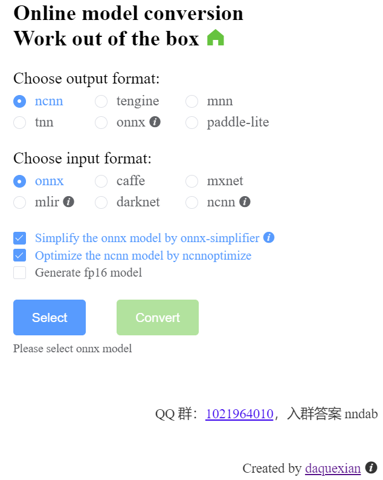
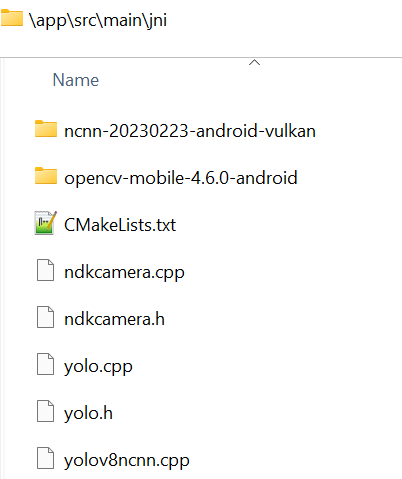

# Tutorial on Running YOLOv8 with custom class on Android

## Exploring methods
Before starting with onnx, I have tried to convert `.pt` to `tflite`; however, it's quite difficult to implement the pre and pos-processing for `tflite`.

You can check the python code [here](https://github.com/lamegaton/Machine-Learning-and-AI-Examples/blob/main/Supervised/CNNs/YOLO/Examine%20pre-processing%20and%20pos-processing%20from%20YOLOv8.ipynb) to see how it works. That might be a todo task for later implementation; however, at this moment, we want the app is able to run with our trained model first.

## Steps to implement
If you install yolov8 with pip you can locate the package and edit the source code. Ultranalytics also propose a way to convert directly to ncnn [here](https://github.com/ultralytics/ultralytics/pull/3529), but I have not tried it yet. So, for now we just convert `.pt` file to `.onnx`, and finally to `.param` and `bin`:

My current yolo version is **8.0.155**

These are the steps that we are going to perform:

1. edit sourcecode
2. convert `.pt` to `onnx`
3. convert `onnx` to `.param` and `.bin`
4. Copy opencv and ncnn to app/cpp
5. edit `CMakeLists.txt` with name of opencv and ncnn
6. edit `yolo.cpp`
7. edit `local.properties`
8. Run

### Step 1: edit sourcecode
We need to edit the `forward` function in `cf2` in `ultralytics\nn\modules\block.py`. If you install yolo using pip, you can try the below to find location of your package.

```bash
>>> import ultralytics
>>> ultralytics.__file__
```
 File: `ultralytics\nn\modules\block.py`
```python
class C2f(nn.Module):
    """Faster Implementation of CSP Bottleneck with 2 convolutions."""

    def __init__(self, c1, c2, n=1, shortcut=False, g=1, e=0.5):  # ch_in, ch_out, number, shortcut, groups, expansion
        super().__init__()
        self.c = int(c2 * e)  # hidden channels
        self.cv1 = Conv(c1, 2 * self.c, 1, 1)
        self.cv2 = Conv((2 + n) * self.c, c2, 1)  # optional act=FReLU(c2)
        self.m = nn.ModuleList(Bottleneck(self.c, self.c, shortcut, g, k=((3, 3), (3, 3)), e=1.0) for _ in range(n))

    def forward(self, x):
        # y = list(self.cv1(x).split((self.c, self.c), 1))
        # y.extend(m(y[-1]) for m in self.m)
        # return self.cv2(torch.cat(y, 1))

        print("ook")
        x = self.cv1(x)
        x = [x, x[:, self.c:, ...]]
        x.extend(m(x[-1]) for m in self.m)
        x.pop(1)
        return self.cv2(torch.cat(x, 1))
    
    def forward_split(self, x):
        print("ook")
        x = self.cv1(x)
        x = [x, x[:, self.c:, ...]]
        x.extend(m(x[-1]) for m in self.m)
        x.pop(1)
        return self.cv2(torch.cat(x, 1))

```
File: `ultralytics\nn\modules\head.py`
```python
class Detect(nn.Module):
    """YOLOv8 Detect head for detection models."""
    dynamic = False  # force grid reconstruction
    export = False  # export mode
    shape = None
    anchors = torch.empty(0)  # init
    strides = torch.empty(0)  # init

    def __init__(self, nc=80, ch=()):  # detection layer
        super().__init__()
        self.nc = nc  # number of classes
        self.nl = len(ch)  # number of detection layers
        self.reg_max = 16  # DFL channels (ch[0] // 16 to scale 4/8/12/16/20 for n/s/m/l/x)
        self.no = nc + self.reg_max * 4  # number of outputs per anchor
        self.stride = torch.zeros(self.nl)  # strides computed during build
        c2, c3 = max((16, ch[0] // 4, self.reg_max * 4)), max(ch[0], min(self.nc, 100))  # channels
        self.cv2 = nn.ModuleList(
            nn.Sequential(Conv(x, c2, 3), Conv(c2, c2, 3), nn.Conv2d(c2, 4 * self.reg_max, 1)) for x in ch)
        self.cv3 = nn.ModuleList(nn.Sequential(Conv(x, c3, 3), Conv(c3, c3, 3), nn.Conv2d(c3, self.nc, 1)) for x in ch)
        self.dfl = DFL(self.reg_max) if self.reg_max > 1 else nn.Identity()

    def forward(self, x):
        """Concatenates and returns predicted bounding boxes and class probabilities."""
        shape = x[0].shape  # BCHW
        for i in range(self.nl):
            x[i] = torch.cat((self.cv2[i](x[i]), self.cv3[i](x[i])), 1)
        if self.training:
            return x
        elif self.dynamic or self.shape != shape:
            self.anchors, self.strides = (x.transpose(0, 1) for x in make_anchors(x, self.stride, 0.5))
            self.shape = shape

        # x_cat = torch.cat([xi.view(shape[0], self.no, -1) for xi in x], 2)
        # if self.export and self.format in ('saved_model', 'pb', 'tflite', 'edgetpu', 'tfjs'):  # avoid TF FlexSplitV ops
        #     box = x_cat[:, :self.reg_max * 4]
        #     cls = x_cat[:, self.reg_max * 4:]
        # else:
        #     box, cls = x_cat.split((self.reg_max * 4, self.nc), 1)
        # dbox = dist2bbox(self.dfl(box), self.anchors.unsqueeze(0), xywh=True, dim=1) * self.strides

        # if self.export and self.format in ('tflite', 'edgetpu'):
        #     # Normalize xywh with image size to mitigate quantization error of TFLite integer models as done in YOLOv5:
        #     # https://github.com/ultralytics/yolov5/blob/0c8de3fca4a702f8ff5c435e67f378d1fce70243/models/tf.py#L307-L309
        #     # See this PR for details: https://github.com/ultralytics/ultralytics/pull/1695
        #     img_h = shape[2] * self.stride[0]
        #     img_w = shape[3] * self.stride[0]
        #     img_size = torch.tensor([img_w, img_h, img_w, img_h], device=dbox.device).reshape(1, 4, 1)
        #     dbox /= img_size

        # y = torch.cat((dbox, cls.sigmoid()), 1)
        # return y if self.export else (y, x)
        print("ook")
        return torch.cat([xi.view(shape[0], self.no, -1) for xi in x], 2).permute(0, 2, 1)
```

### Step 2: convert `.pt` to `onnx`
> yolo task=detect mode=export model=best.pt format=onnx simplify=True opset=13 imgsz=416

### Step 3: convert `onnx` to `.param` and `.bin`
https://convertmodel.com/



### Step 4: copy opencv and ncnn to app/cpp
Directory: `app/src/main/jni`




### Step 5: edit `CMakeLists.txt` with name of opencv and ncnn

### Step 6: edit `yolo.cpp`

### Step 7: edit `local.properties`

### Step 8: RUN